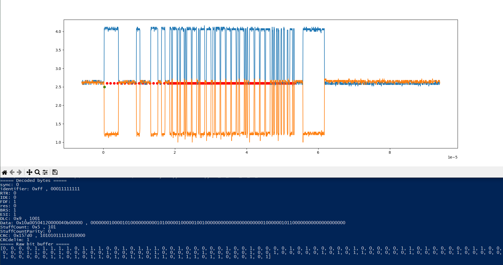

# CANFD analyzer
## Content
### main.py
This Python script is used to retrieve waves/measurements from a Tektronix 2022B Oscilloscope and decode a CANFD packet from it. It is limited to CANFD packets with 11 bits identifiers only and does not support standard CAN packets.
### Oscilloscope.py
This Python library contains a class that is used to retrieve the wave measurements from the Tektroniks Oscilloscope thanks to the VISA standard.
### CANParser.py
This Python library contains a class that processes the raw wave measurement of both CAN lines and decodes it into the CANFD packet bits.
## Requirements
The installation of the “NI-VISA” software is required to make it the analyzer work. It might be possible that it works without it but that was not tested.
## Operation
To use this program, the oscilloscope must be connected to the PC by USB and its "device instance path" might need to be set in "main.py". A wave containing a CANFD packet must then be captured on the oscilloscope using a trigger. The entire packet must be visible and the channels for CANL and CANH must be activated. A recommended time resolution is 10us/div.
Once a packet is captured, the script can be ran and it will print the decoded bits into the CMD as well as plot the captured wave with the sampling times of the bits.

