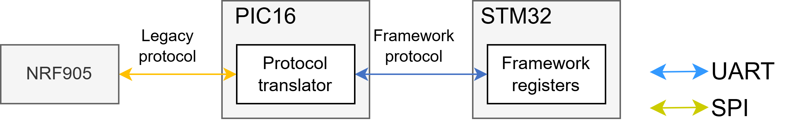

##Envirobot Radio PC client V2.0

This folder contains a Python script to interact with the Envirobot V2.0 registers through its radio interface. This should be ran on a PC with an appropriate USB radio dongle.

The client is started with this command: **python RadioClient.py -c 81 -p COM3**
with 81 being the radio channel and COM3 the virtual COM port (VCP) of the USB radio dongle.
The user can then enter commands to interact with the robot registers.
the “help” command can be used to print the full list of supported commands and their corresponding descriptions.

When entering a register address, it is important to be aware that it will go through the custom address mapping process when reaching the "radio" PIC16. Thus the entered address must be a “legacy” address that was previously mapped to a “framework” address in the PIC16.
